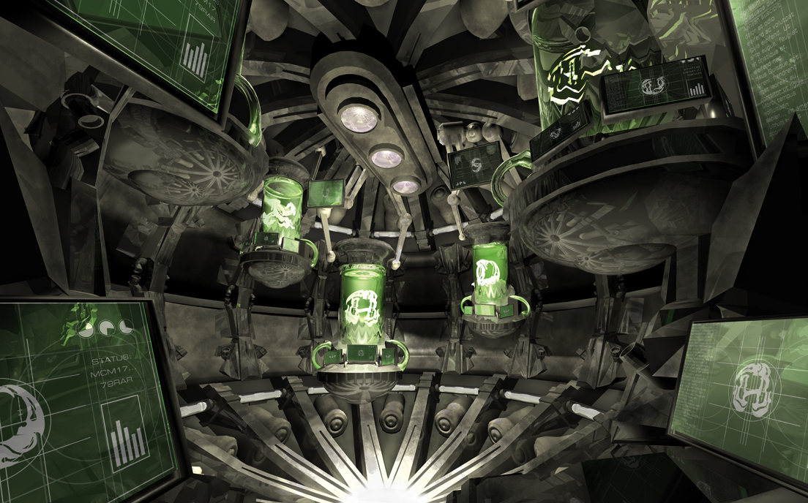

Alchemetal is a highly ornamental, unicase display face intended for use with grungy, mysterious or aggressive themes. Each character is constructed from a set of reusable components, drawing from the theme of trans-mutation in Alchemy.

The bulk of the letterforms fit within a perfect circle, with sharp edges pushing out beyond their boundaries. This symbolizes the driving spirit of rebellion behind Metal music.
