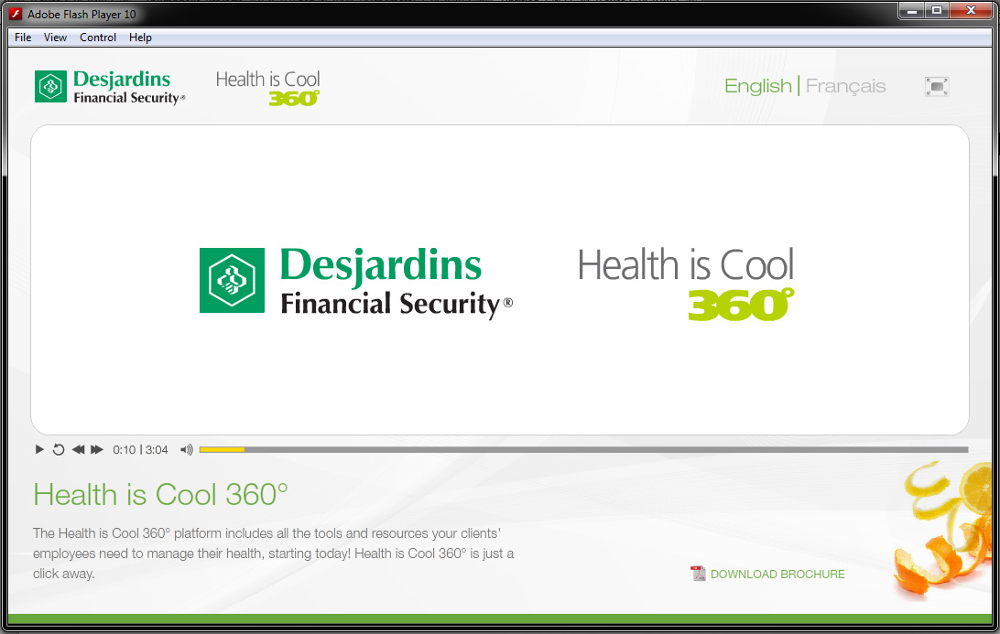
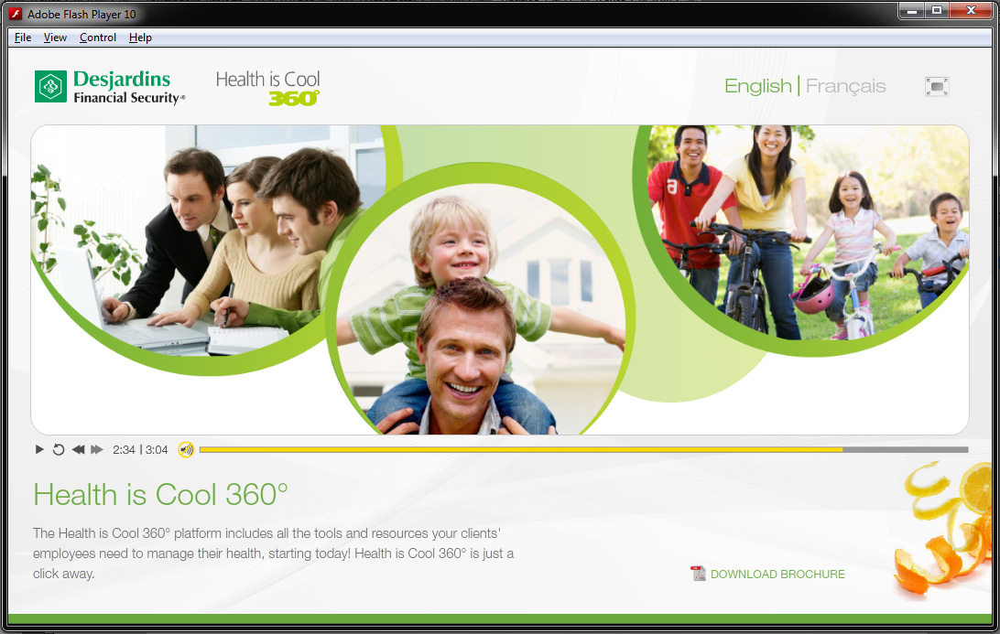

Innovative service can help plan members find the answers to their healthcare questions, all in one place. We developed a multi-platform desktop application to assist internal sales teams.

The application featured interactive presentations and comprehensive healthcare information to support sales conversations.

