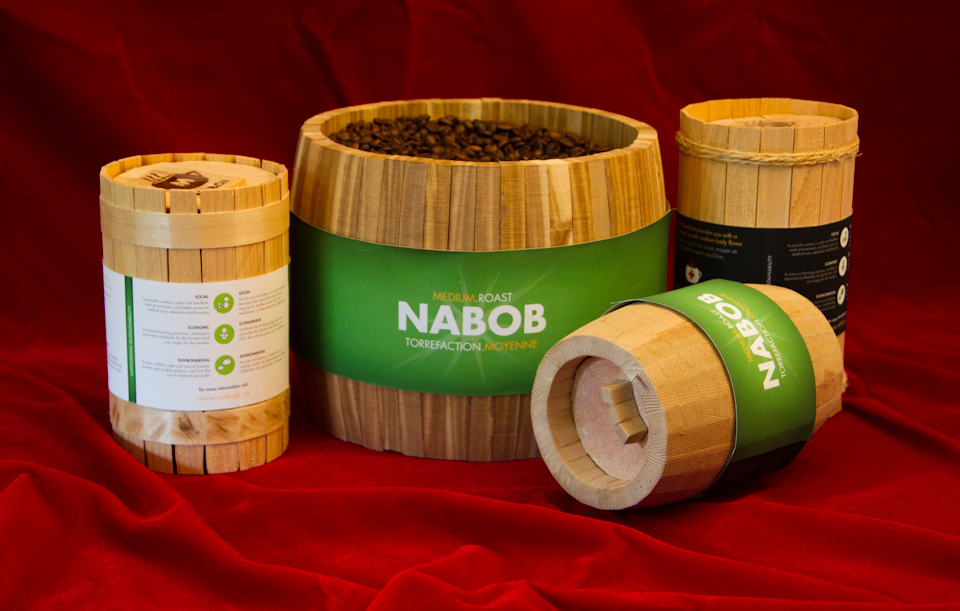
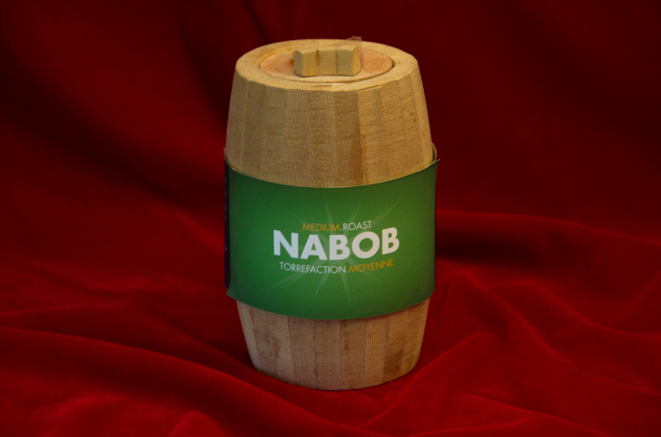
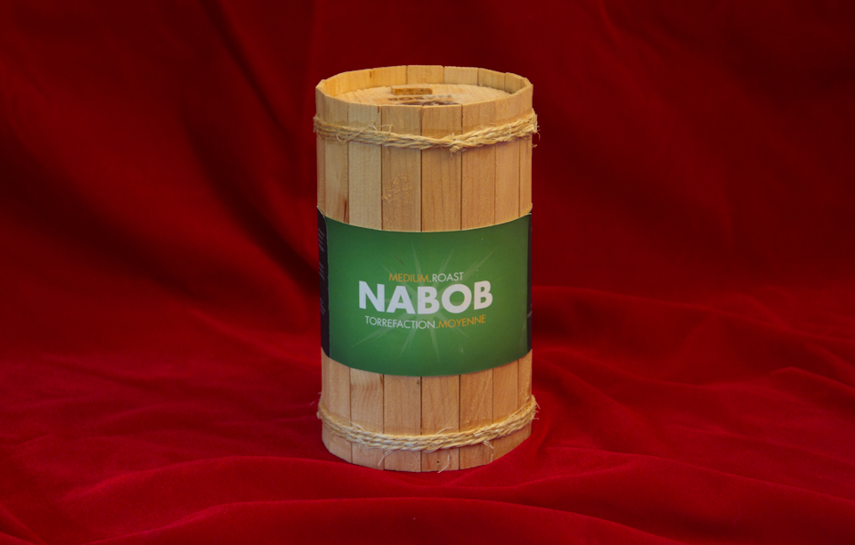
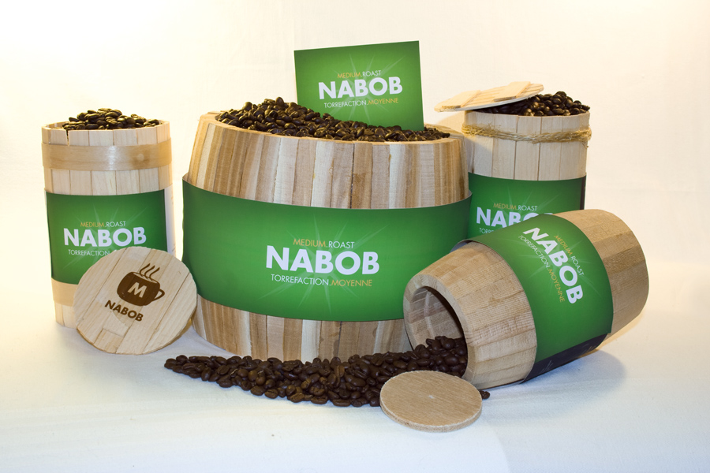

Nabob Coffee has been moving towards eco-friendly packaging. Our proposal was to replace existing containers with small barrels. The wooden barrels are resilient (fewer units to replace), versatile (promoting re-use), and low-impact (minimizing resource/processing waste).

The bottom of each barrel is equipped with a simple mechanism that administers enough beans for one cup of coffee, per 360-degree rotation.

