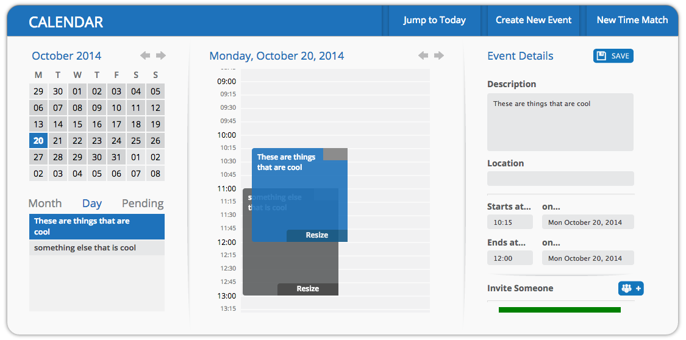
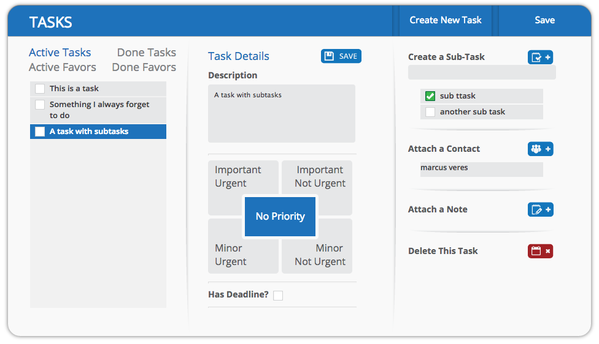
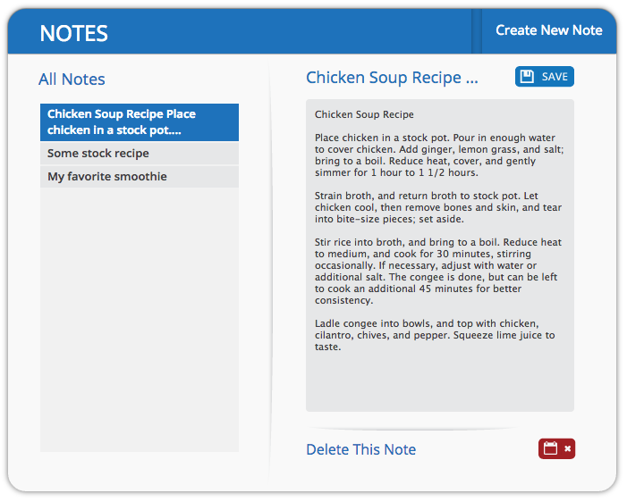

A hobby project: an application that integrates a calendar, task list, address book and instant messenger. I cut my teeth on PHP frameworks building this app.

The application featured a cohesive design language across all modules, providing a unified productivity suite.

