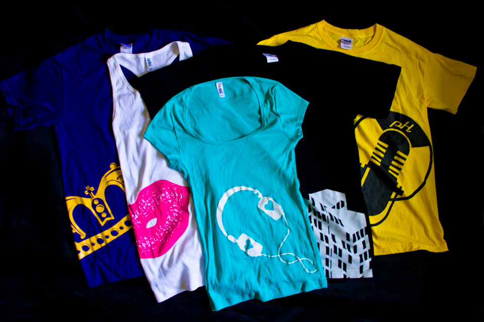
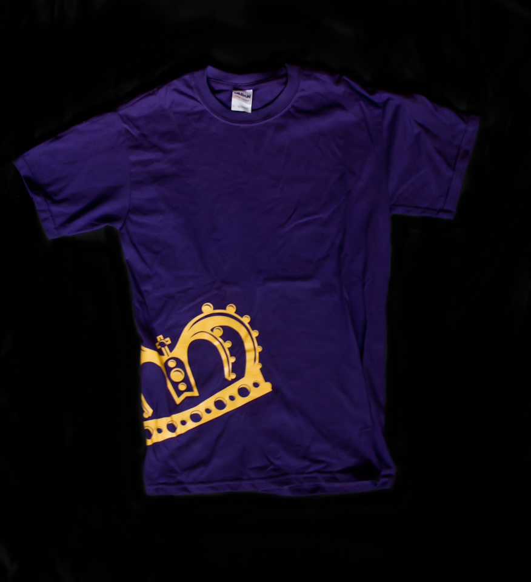
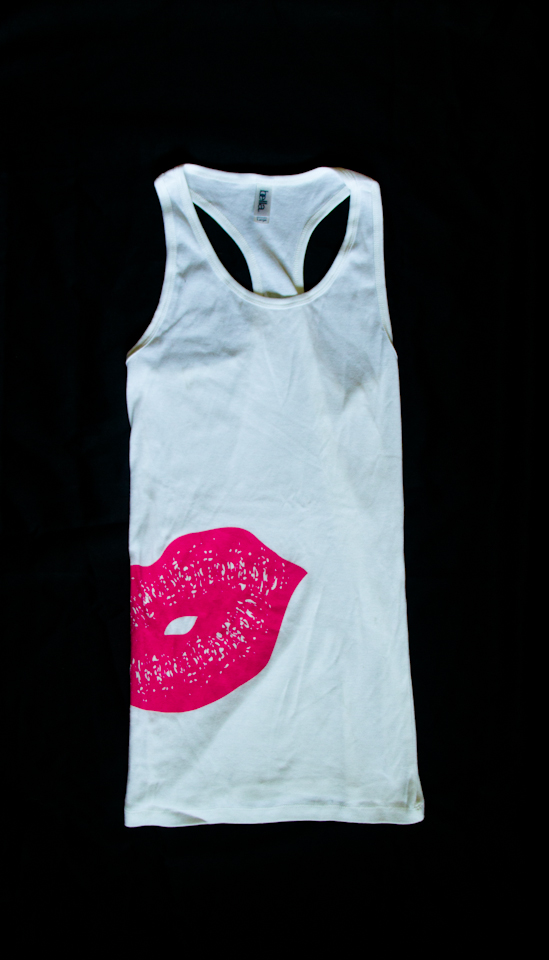
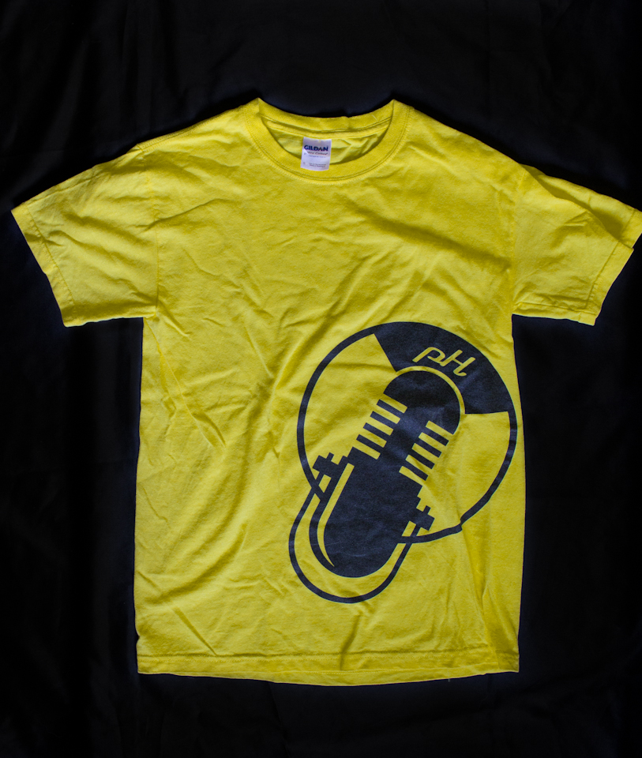

PhScale 7 is an independent clothing company that produces casual apparel for the young, urban crowd. Photo credit (top) Ted Belton Photography.

The first season featured bold, illustrative designs across a range of casual wear, each piece designed to make a statement.

