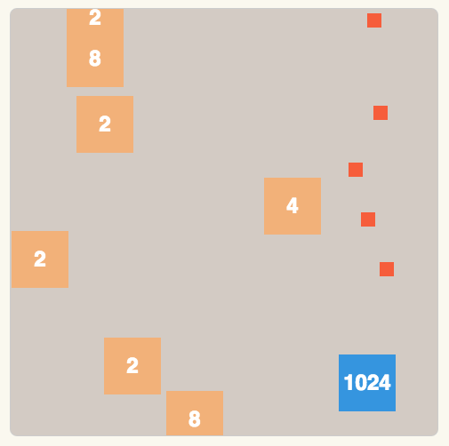

My take on 2048. I added old-school shoot-em-up game elements, with the ability to destroy unwanted blocks. Difficulty ramps up the higher up you go, with desirable blocks decreasing in frequency.

The game combines puzzle mechanics with arcade action, creating a unique twist on the popular 2048 formula.
