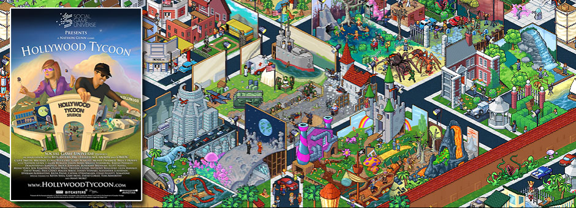
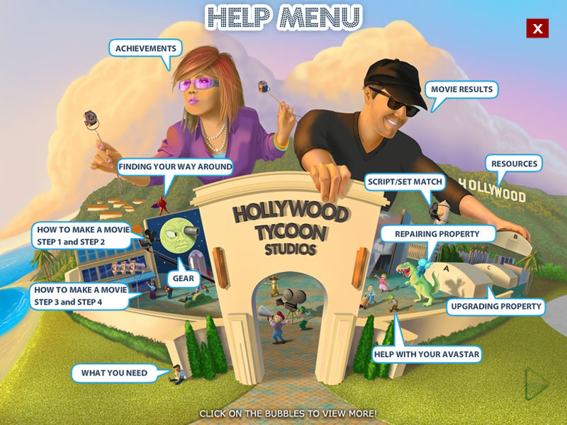
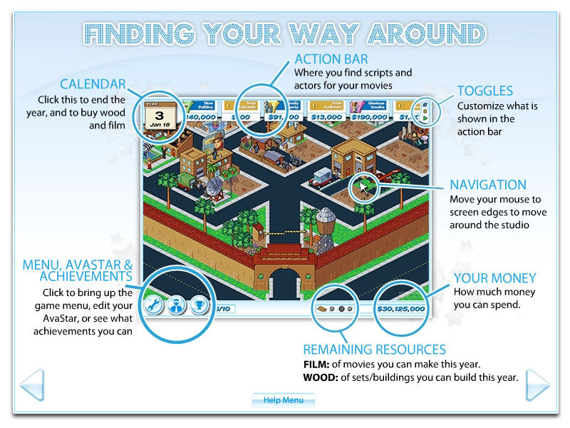

"Hollywood Tycoon has boasted claims that it is 'one of the best casual tycoon games available'. Tall order, but hold your hats because with it now on Facebook, it more than deserves the praise it gets" - Hollywood Tycoons are Made in Canada – Inside Social Games

Players build and manage their own Hollywood studio, managing talent, producing films, and building their entertainment empire.

