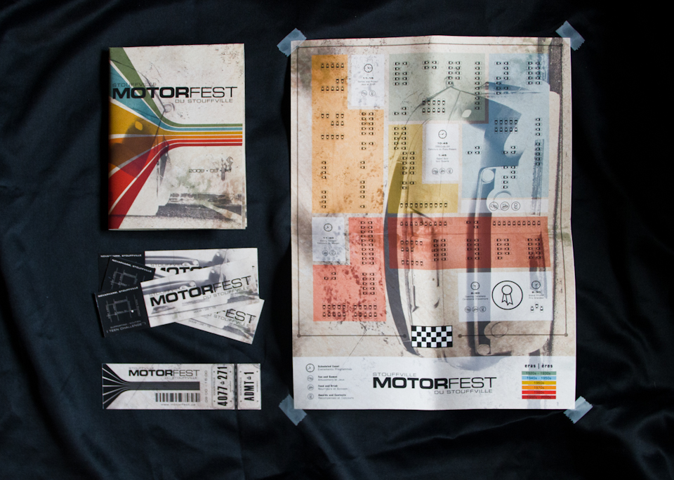
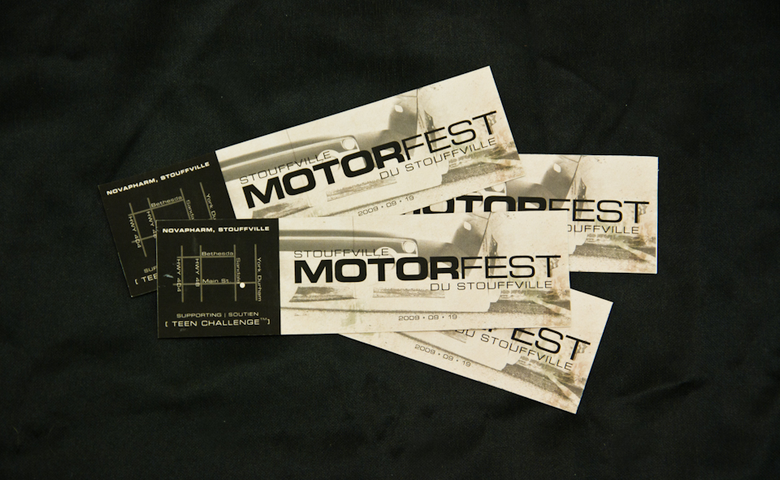
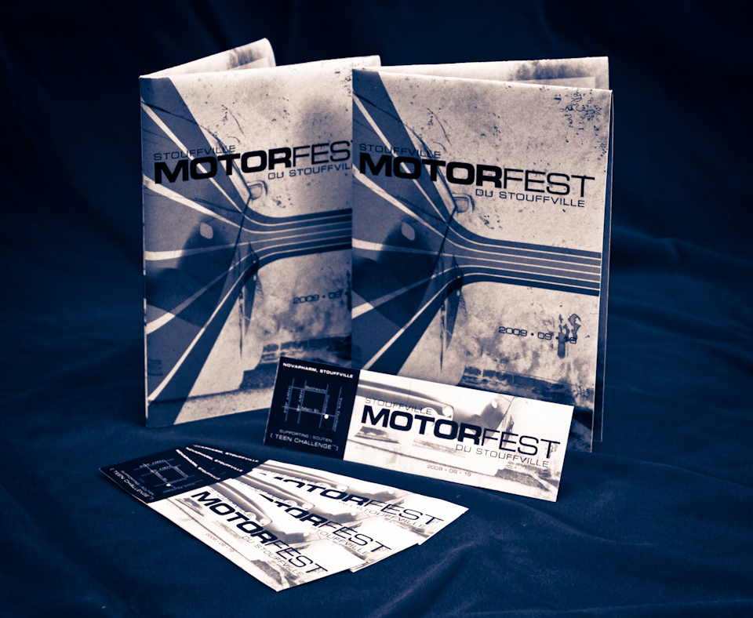

Stouffville's Motor Festival is an annual, outdoor exhibition that showcases motor vehicles from all over Ontario. A step away from mainstream AutoShows, the MotorFest focuses less on the latest concepts and models, and more on the celebration of automobile culture.

The event required comprehensive branding including event maps, tickets, and promotional materials to guide attendees through the exhibition.

