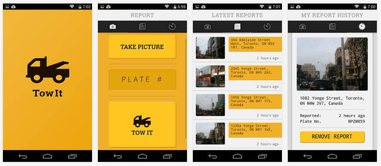
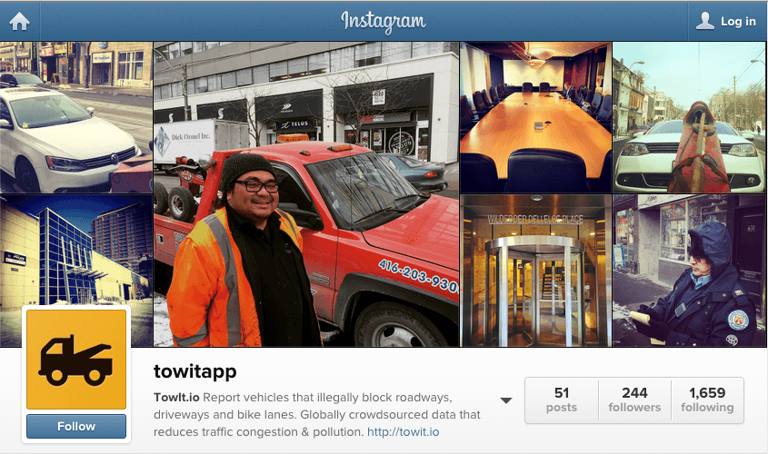

Towit is a service that allows users to report vehicles that illegally block roadways, driveways and bike lanes.

I designed and developed the user interface, branding, and visual assets for the website and mobile application.

The app featured location-based reporting, photo uploads, and real-time notifications to help cities manage parking violations more effectively.
