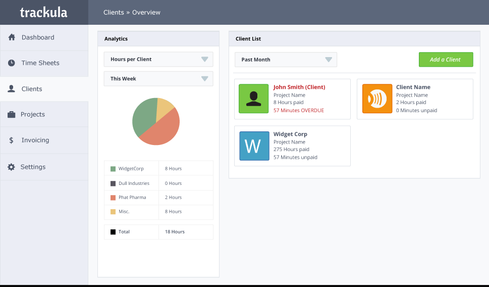
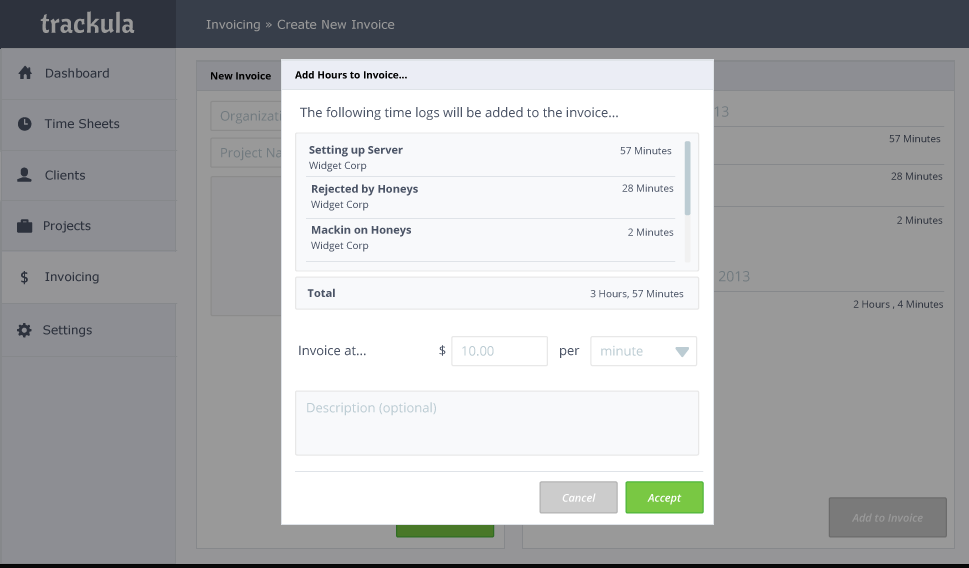

Trackula is a time-tracking and invoicing application. It offers two different modes - one for contractors and one for project managers, each with their own feature sets.

The application was designed with careful attention to user workflows, with wireframes documenting the entire user experience.

