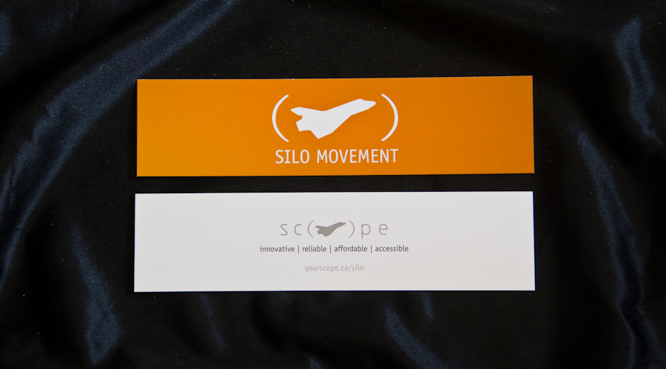
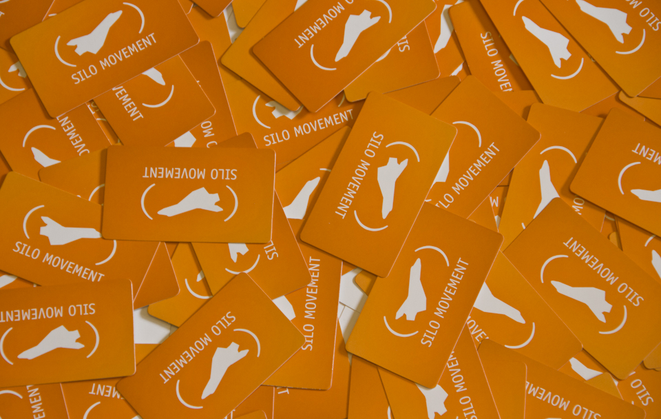
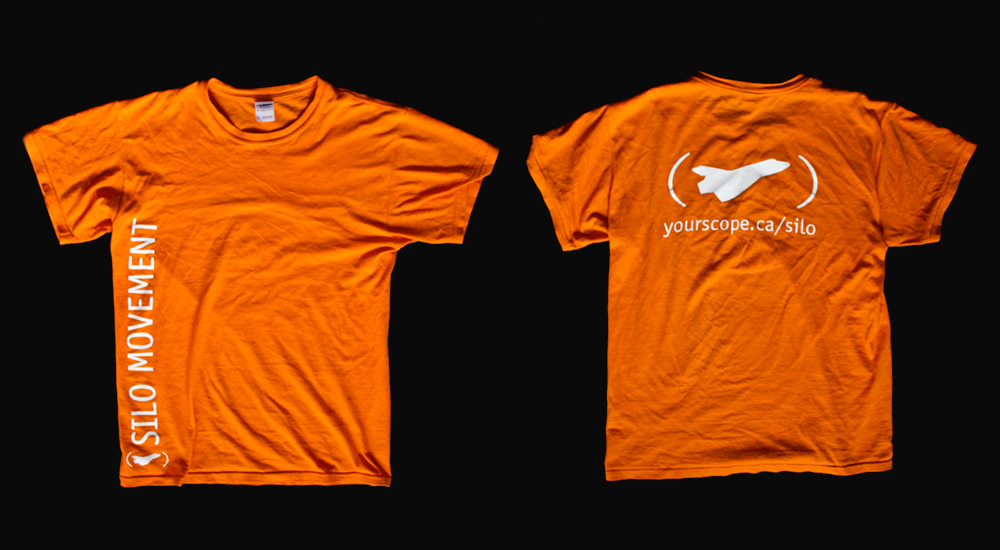

The Supplementary Interactive Learning Opportunity (SILO) was an online tutoring system, intending to provide elementary-school students with additional lectures outside of school hours.

The marketing package included various branded materials to promote the service to schools, parents, and students.

